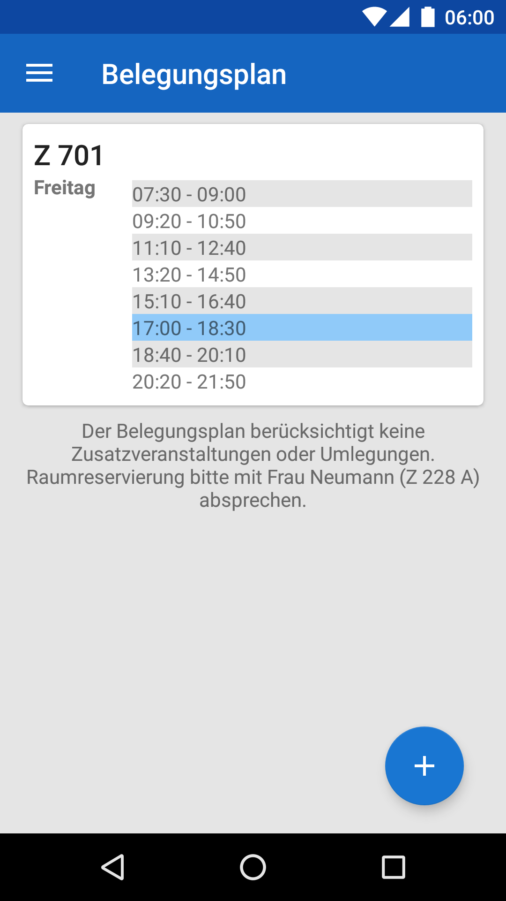

# HTWDresden
Die App für Studenten der HTW Dresden.

HTWDresden ist ein eigenständiges, inoffizielles Projekt und nicht durch die HTW Dresden selbst vertreten. Das Benutzen erfolgt auf eigene Verantwortung.
* Ansprechpartner: Frau Prof. Dr.-Ing. Kühn.
* Entwickler: Kay Förster M.Sc.
* Kontakt: app@htw-dresden.de

## Screenshots
     

## Installation
Eine ausführliche Installtionsanleitung für dein Android-Smartphone findest du in unserem [Wiki](https://github.com/HTWDD/HTWDresden/wiki/Installation).

## Credits
Mit Icons von:
* [Google](https://www.google.com/design/icons/)
* [Vectorgraphit](http://www.flaticon.com/authors/vectorgraphit)
