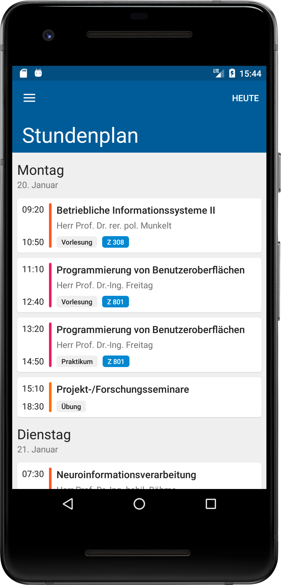
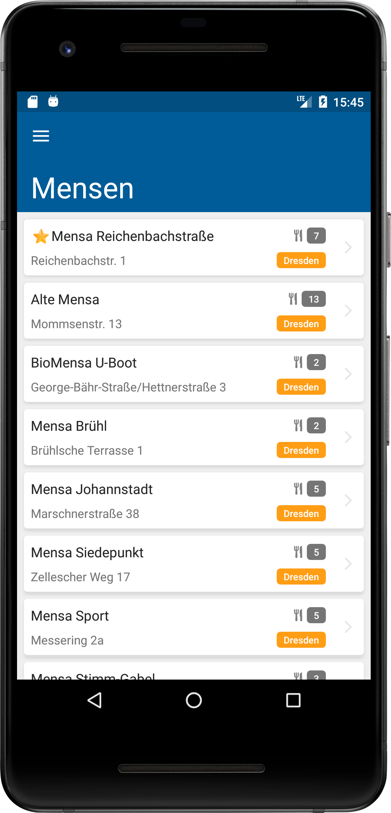
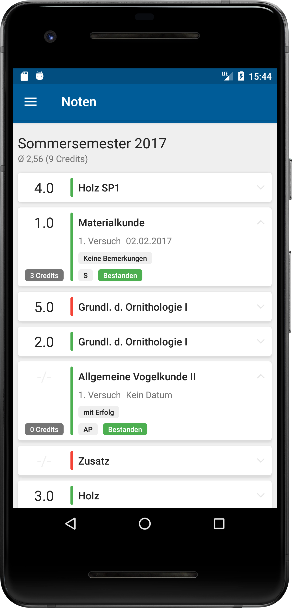
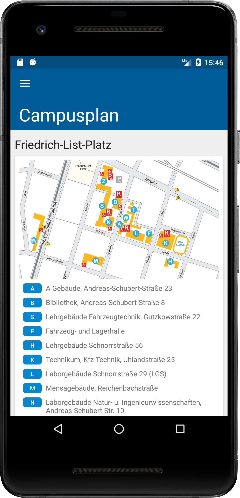

# About
The 'HTW Dresden App' is a student-initiated project that enables students of the [University of Applied Sciences Dresden](https://www.htw-dresden.de/) (HTW) to access their schedule, audit plan, grades and more easily. After some years the management of the HTW decided to continue the development of the app and equalize the featureset of the the apps for iOS and Android to ensure the best user experience.

# Screenshots
 

 
 
 

# Availability
You can download the app from Google Play Store.

# Credits
Our credits go to the initiators of this project:
* [Kay Förster M.Sc.](https://github.com/FestPlatin)
* [loudedtwist](https://github.com/loudedtwist)
* [Meralium](https://github.com/Meralium)
* [eikw](https://github.com/eikw)

# Current status
The app is currently maintained by [Develappers GmbH](https://www.develappers.de/). Feature requests and bugs can be filed by sending an email to the official app related address app@htw-dresden.de of the University of Applied Sciences Dresden. If you want to support this project, you're welcome. You can find general contact information in our [GitHub profile](https://github.com/DevelappersGmbH) or at our website.
